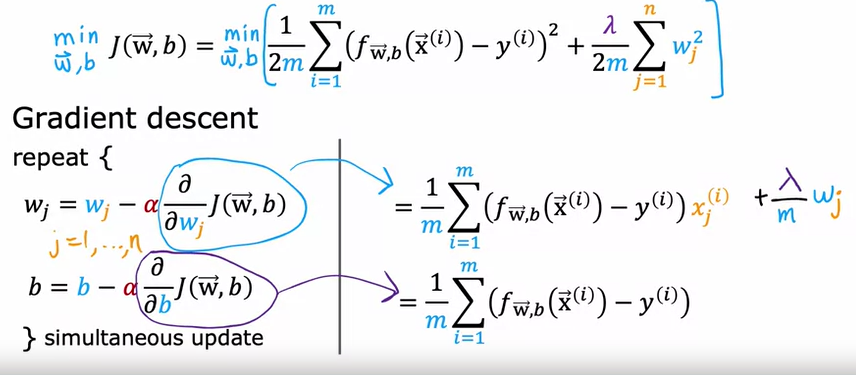

# Machine Learning Basic
## Week 1

Begin ML -> Cost function formula

Understandable

2 main type of ML:

- Supervised : training set is labelled
    

    + Regression : predict result on an infinite possible out come
    + Classification : group the result, works when there's small group of result, predict discrete labels or categories

- Unsupervised : training set is unlabelled
    
    + Cluster

Some conclusion:
- Gradient Descent is powerful to find local min
- Algo for each use case

## Week 2

- Understanding LiR with multiple features
- Vectorize with numpy help utilize hardware acc
- Feature scaling is necessary when the value is way to large or too small compare to other feature
- Feature Engineer help form the shape of the graph to be more fit in the training set
- Poly Reg is not much diff

## Week 3

- Classification = Logistic Reg
- Sigmoid func is used to make a prediction base on the function value
- Decision boundary is a threshold that if exceed, it may raise as positive
- Lost function for logistic reg is:

$$
\begin{cases}
-\log(f_{w,b}(\vec{x}^{(i)})) & \text{if } y^{(i)} = 1 \\
-\log(1 - f_{w,b}(\vec{x}^{(i)})) & \text{if } y^{(i)} = 0
\end{cases}
$$

- Simplify above equation is quite ez
- Over/Under fitting is situation when the model fit too well/too bad with the training set, often happen when there're too many feature
- Addressing Overfit:
    + Regularization: reduce weight of some feature so that it became insignificant instead of slay it
    + Get more training batch
    + choose which feature is most relevant (feature selection)
- Regularization in cost function (linear) and apply with GD: 
    

logistic make not much difference

# Neural Network and Deep Learning
## Week 1
- Not much other than introducing to neural network and point out some type of NN

## Week 2
- Say n is the number of feature in 1 training batch, m is size of training set, we got this interesting change of way to represent input, output:

X = n x m , Y = 1 x m

- Revision of ML Basic and basics deriv
- ford prop is to calculate current loss, back prop is to cal the grad descent, grad desc is just update the param (w,b)
- Revision of Vectorization, apply on log reg
- Broadcasting:
    + Resize the matrix in the operation for validity
    + Can't resize more than 1 dimension
    + Ex: (3,4) (1,4) -> valid, (3, 4) (1,2) -> nuh uh
    + Allowed: (3,4) {operator} *a number: (3,4) * 2 -> every element is doubled

- Attending lab, very interesting, looking to make this from scratch with cuda c/c++
- Lab done, working on week3

## Week 3
Neural network representation:
$X_{1}^{[2](3)}$ means the $1^{st}$ features (or node, count from 1) in $2^{nd}$ layers in the $3^{rd}$ examples

Call $X = [x^{(1)},x^{(2)},...,x^{(m)}]$ with $x^{(i)}$ mean the input layer in the i example

Call $A^{[1]} = [a^{[1](1)},a^{[1](2)},...,a^{[1](m)}]$ mean the $1^{st}$ hidden layer and in each example from 1->m

the rest may apply the same, and consider $X = A^{[0]}$

We can vectorize the computation to:

$$
Z^{[1]} = W^{[1]}A^{[0]}+b^{[1]} \\
A^{[1]} = \sigma(Z^{[1]}) \\
Z^{[2]} = W^{[2]}A^{[1]}+b^{[2]} \\
A^{[2]} = \sigma(Z^{[2]}) \\
... \\
Z^{[m]} = W^{[2]}A^{[m-1]}+b^{[m]} \\
A^{[m]} = \sigma(Z^{[m]}) \\
$$

Sigmoid activation function can also be replace with __tanh__ function, or __RELU__, try them all to see which fit best

Each layer might have their own activation function, for ex, layer 1 use sigmoid, layer 2 use relu, ....

